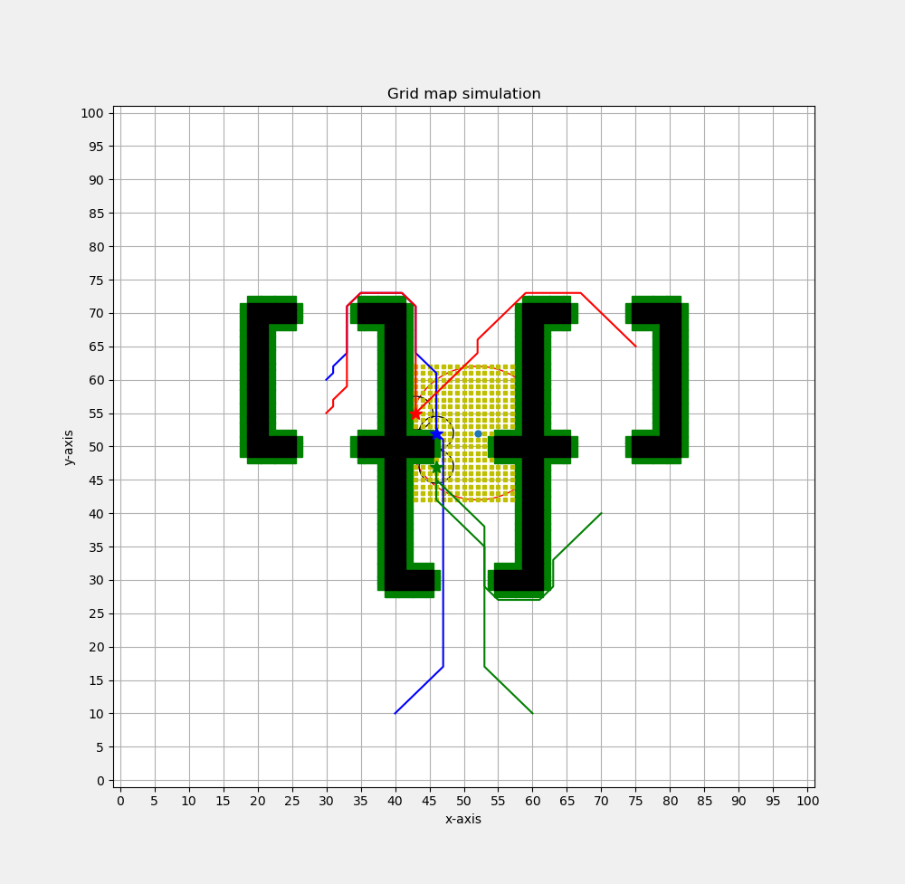
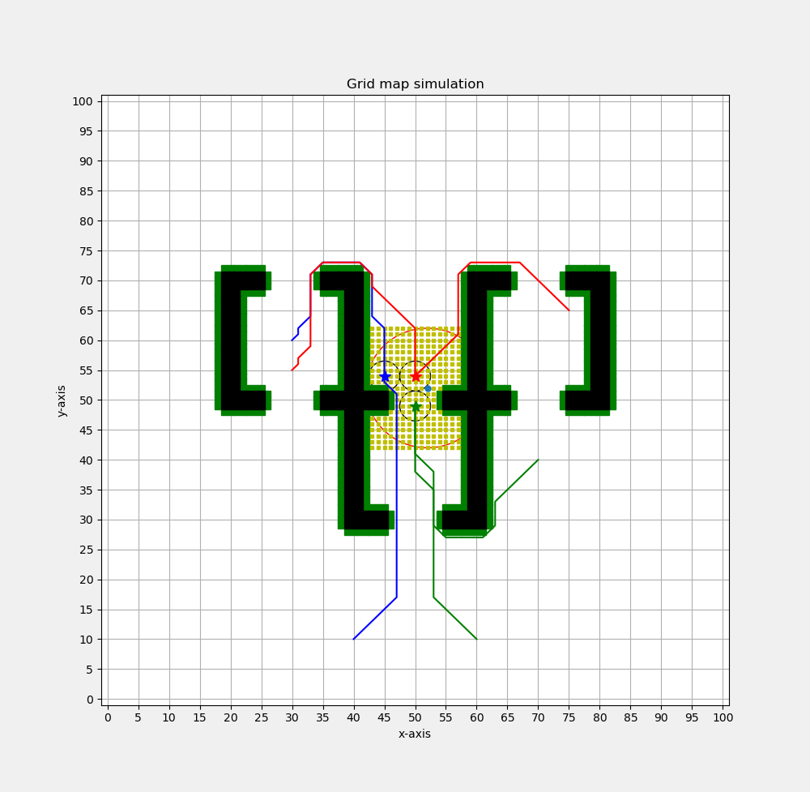
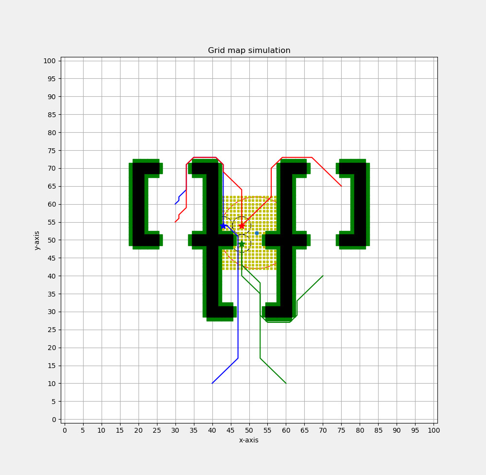

# Experiment 1

**Data:**

start_points = [(30, 60), (40, 10), (75, 65), (30, 55), (70, 40), (60, 10)]

comm_agent_distance = [91.59797974644664, 91.11269837220809, 90.84062043356592, 90.8406204335659, 89.4558441227157]

comm_pos_multi_set = [[(43, 54), (48, 54), (48, 49)], [(43, 54), (48, 54), (51, 50)], [(44, 54), (49, 54), (49, 49)], [(45, 54), (50, 54), (50, 49)], [(46, 52), (43, 55), (46, 47)]]

**Figure:**

