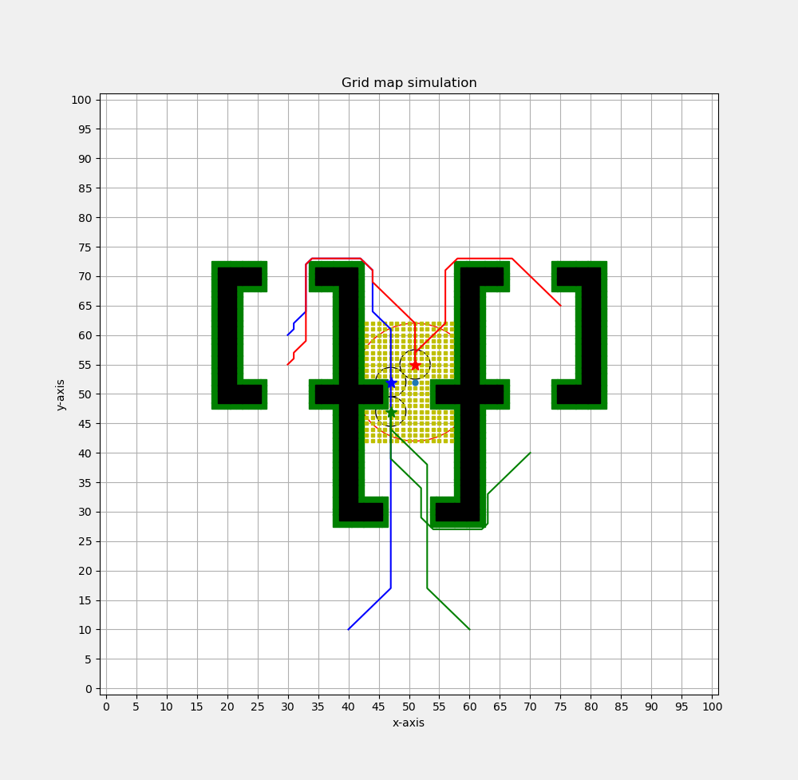

# Experiment 2

**Data:**

start_points = [(30, 60), (40, 10), (75, 65), (30, 55), (70, 40), (60, 10)]

comm_agent_distance = [90.6274169979695, 90.6274169979695, 90.6274169979695, 90.6274169979695, 90.6274169979695]

comm_pos_multi_set = [[(47, 52), (50, 56), (51, 49)], [(47, 52), (51, 55), (47, 47)], [(47, 52), (51, 55), (49, 48)], [(47, 52), (51, 55), (50, 48)], [(47, 52), (51, 55), (51, 49)]]

**Figure:**

