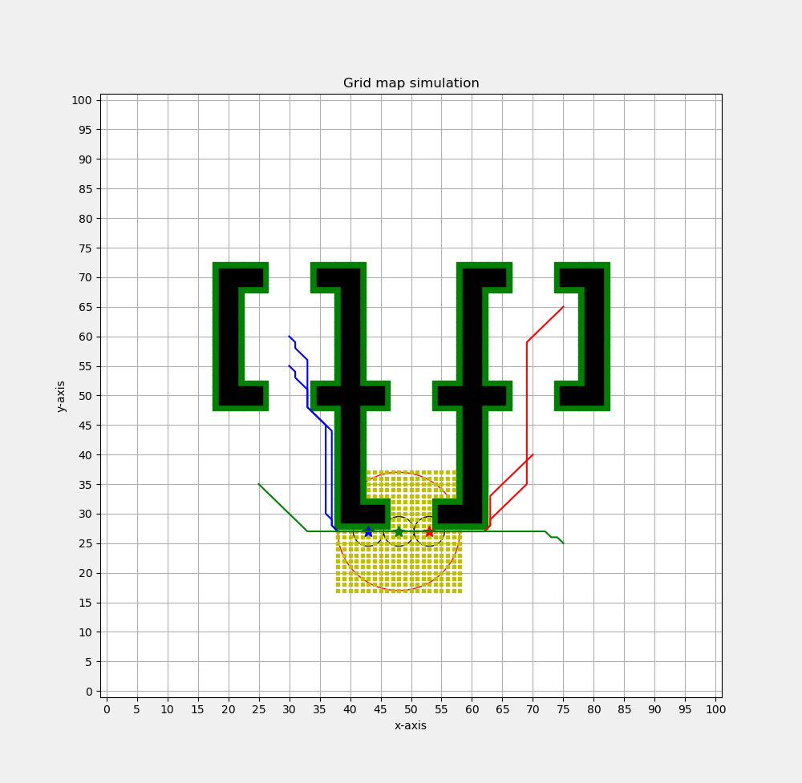
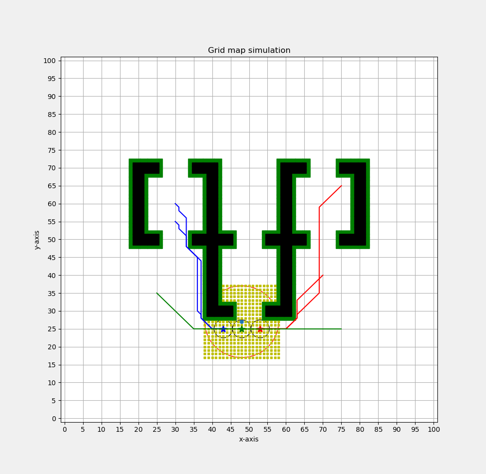
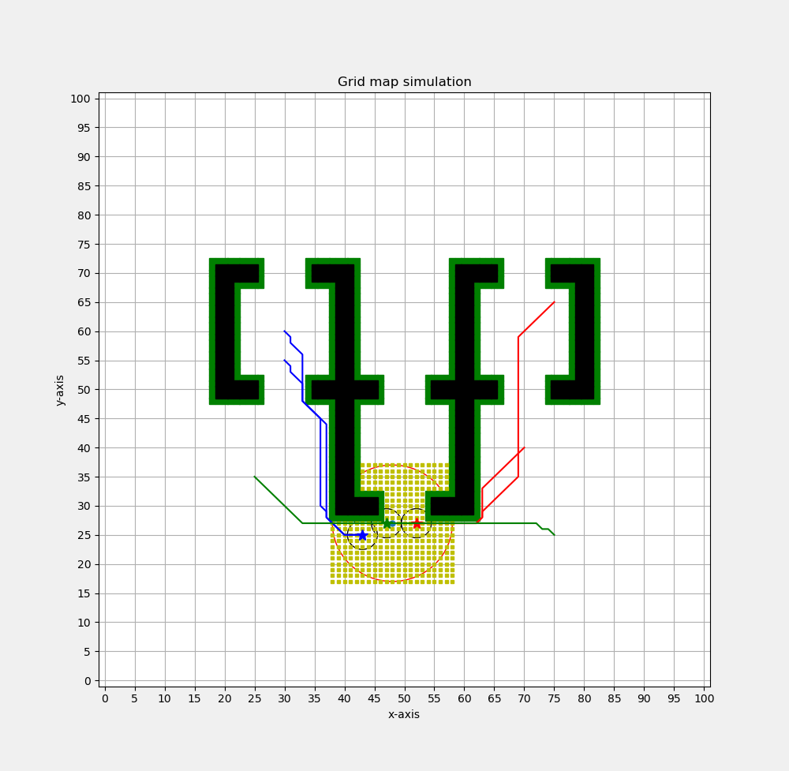

# Experiment 3

**Data:**

start_points = [(30, 60), (30, 55), (75, 65), (70, 40), (25, 35), (75, 25)]

comm_agent_distance = [79.69848480983498, 79.69848480983498, 79.35533905932735, 78.52691193458116, 77.69848480983498]

comm_pos_multi_set = [[(43, 25), (52, 27), (47, 27)], [(43, 25), (52, 27), (48, 25)], [(43, 25), (53, 25), (48, 25)], [(43, 26), (53, 26), (48, 26)], [(43, 27), (53, 27), (48, 27)]]

**Figure:**

